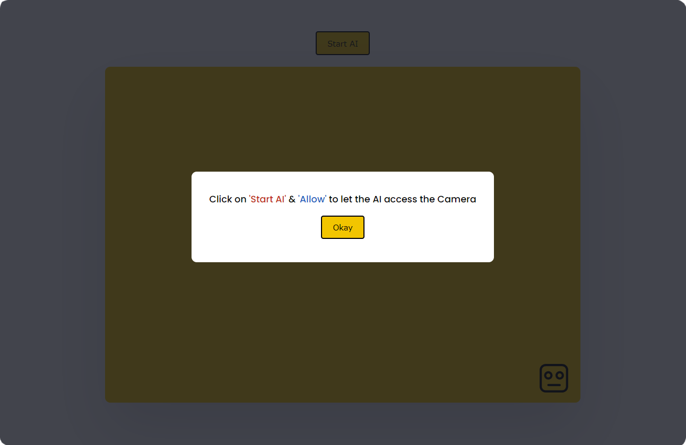

## Recognizing face using JS Library

This program uses FaceAPI JS Library to recognize your mood based on your facial reaction. To make it much simpler I've added some extra functions to it.

## Interface
- Click on anywhere to close the popup
- Click on 'Start AI'
- Allow accessing camera
  

## AI Overview

## Acknowledgements
`API used in this project is:`
 - [FaceAPI.JS](https://github.com/justadudewhohacks/face-api.js/)